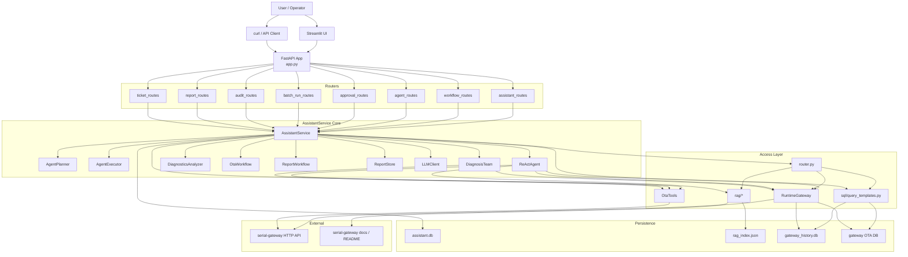

# Gateway AI Assistant Architecture

## 1. 总体定位

`gateway_ai_assistant` 不是独立的设备网关，而是叠加在 `serial-gateway` 之上的 AI 编排与治理层。

职责边界：

- `serial-gateway`
  - 负责真实设备通信、历史数据持久化、OTA 执行和监控 HTTP API
- `gateway_ai_assistant`
  - 负责问答、检索、结构化查询、规则诊断、审批、报告、工单、批量治理和 Agent 编排
- `Streamlit / FastAPI`
  - 负责演示交互和对外 API 暴露

## 2. 总体架构图



## 3. 分层结构

### 3.1 接入层

文件：

- [app.py](app.py)
- [streamlit_app.py](streamlit_app.py)

职责：

- 创建 FastAPI 应用和单例 `AssistantService`
- 注册所有路由
- 提供 Streamlit 演示台

特征：

- 这一层不保存业务状态
- 业务状态都沉到 `AssistantService`、LangGraph checkpoint 和 SQLite

### 3.2 路由层

文件：

- [api/assistant_routes.py](api/assistant_routes.py)
- [api/workflow_routes.py](api/workflow_routes.py)
- [api/agent_routes.py](api/agent_routes.py)
- [api/approval_routes.py](api/approval_routes.py)
- [api/batch_run_routes.py](api/batch_run_routes.py)
- [api/audit_routes.py](api/audit_routes.py)
- [api/report_routes.py](api/report_routes.py)
- [api/ticket_routes.py](api/ticket_routes.py)

职责：

- 做请求模型解析
- 调用 `AssistantService`
- 返回统一 JSON

### 3.3 核心编排层

文件：

- [service.py](service.py)

这是系统中枢，负责统一持有并协调所有核心模块：

```text
AssistantService
├── 基础设施
│   ├── Settings
│   ├── AssistantDB
│   ├── GatewayDB(history)
│   ├── GatewayDB(ota)
│   └── LLMClient
├── 工具层
│   ├── RuntimeGateway
│   └── OtaTools
├── 业务层
│   ├── OtaWorkflow
│   ├── ReportWorkflow
│   ├── DiagnosticsAnalyzer
│   └── ReportStore
├── Agent 层
│   ├── AgentPlanner
│   ├── AgentExecutor
│   ├── DiagnosisTeam
│   └── ReActAgent (lazy init)
└── 对外接口
    ├── chat / _chat_v1
    ├── chat_agent / chat_agent_stream / chat_agent_resume
    ├── workflow_*
    ├── approvals / reports / tickets / batch_runs / audits
    └── run_agent_live_eval
```

## 4. 三条主执行链路

### 4.1 V1 问答链路

用于传统 `RAG / SQL / Hybrid / Runtime` 问答。

```text
POST /assistant/chat
  -> AssistantService.chat()
    -> 优先尝试 chat_agent()（有 LLM key 时）
    -> 失败或禁用则降级到 _chat_v1()

_chat_v1():
  -> classify_question()
     -> Guide / Runtime / SQL / Hybrid / RAG
  -> 调对应子流程
  -> LLM 负责解释
  -> query_logs 落库
```

关键文件：

- [router.py](router.py)
- [llm_client.py](llm_client.py)
- [rag/retriever.py](rag/retriever.py)
- [sql/query_templates.py](sql/query_templates.py)

### 4.2 Workflow 链路

用于确定性业务动作，不依赖模型自治决策。

```text
POST /assistant/workflow/*
  -> AssistantService.workflow_*
    -> OtaWorkflow / ReportWorkflow / DiagnosticsAnalyzer
    -> RuntimeGateway / OtaTools / query_templates
    -> 审批、审计、报告、batch_run 等落库
```

典型场景：

- OTA 风险检查
- 单设备审批创建
- 批量灰度计划
- 批量审批创建
- 报告生成
- 故障诊断

### 4.3 LangGraph Agent 链路

用于真正的 ReAct tool calling、多步决策、HITL 和流式事件。

```text
POST /assistant/agent/chat
  -> AssistantService.chat_agent()
    -> ReActAgent.invoke()

POST /assistant/agent/stream
  -> AssistantService.chat_agent_stream()
    -> ReActAgent.astream()

POST /assistant/agent/resume
  -> AssistantService.chat_agent_resume()
    -> ReActAgent.resume()
```

## 5. LangGraph Agent 架构

关键文件：

- [agent/react_agent.py](agent/react_agent.py)
- [agent/langgraph_tools.py](agent/langgraph_tools.py)

内部组件：

```text
ReActAgent
├── LLM
│   └── ChatOpenAI
├── Checkpoint
│   └── MemorySaver
├── Middleware
│   └── HumanInTheLoopMiddleware
├── Tool Sets
│   ├── readonly_tools
│   └── write_tools
├── Session Memory
│   ├── _pending_interrupt_actions
│   └── _pending_manual_actions
└── Public Methods
    ├── invoke()
    ├── astream()
    ├── resume()
    └── inspect_session()
```

### 5.1 只读工具

典型只读工具：

- `get_device_status`
- `get_sensor_history`
- `get_system_events`
- `get_database_summary`
- `search_documents`
- `query_structured_data`
- `ota_risk_check`
- `diagnose_fault`
- `list_approvals`
- `list_reports`

### 5.2 写工具

典型写工具：

- `ota_create_request`
- `approve_ota_request`
- `pause_batch`
- `retry_failed_devices`

### 5.3 HITL 机制

只有高风险写工具才进入 HITL。

```text
LLM 决定调用写工具
  -> HumanInTheLoopMiddleware 拦截
  -> session 进入 interrupt
  -> 返回 pending action
  -> 用户调用 /assistant/agent/resume
  -> approve / reject / edit
  -> 继续执行或停止
```

### 5.4 Streaming 机制

流式事件不是单纯 token 输出，而是结构化事件流：

- `token`
- `tool_start`
- `tool_end`
- `interrupt`
- `final_answer`
- `error`
- `done`

## 6. Multi-Agent 架构

当前不是全系统多 agent 编排，而是第一阶段只读诊断 team。

关键文件：

- [agent/diagnosis_team.py](agent/diagnosis_team.py)

结构：

```text
DiagnosisTeam
├── StatusAgent  -> get_device_status
├── SensorAgent  -> get_sensor_history
├── EventAgent   -> get_system_events
└── OtaAgent     -> list_recent_ota_tasks_for_device
```

执行模式：

- 四路并行采集
- 聚合成统一 `runtime_inputs`
- 输出 `tool_trace + team_trace + collection_mode`

接入点：

- `workflow_diagnose_fault()`
- `workflow_generate_report(report_type="fault_ticket")`

边界：

- 只读
- 不进入审批写链路
- 不参与 OTA 执行决策

## 7. 数据与知识访问层

### 7.1 RAG 子系统

关键文件：

- [rag/document_loader.py](rag/document_loader.py)
- [rag/text_splitter.py](rag/text_splitter.py)
- [rag/embedding.py](rag/embedding.py)
- [rag/indexer.py](rag/indexer.py)
- [rag/retriever.py](rag/retriever.py)

链路：

```text
serial-gateway docs / README
  -> load
  -> chunk
  -> embed
  -> build index
  -> rag_index.json
  -> retrieve
  -> prompt
  -> answer
```

### 7.2 SQL 子系统

关键文件：

- [sql/query_templates.py](sql/query_templates.py)
- [sql/gateway_db.py](sql/gateway_db.py)

原则：

- 不让模型自由生成 SQL
- 统一使用模板化查询函数
- 优先服务于可控查询、统计和回归测试

### 7.3 Runtime 子系统

关键文件：

- [tools/runtime_gateway.py](tools/runtime_gateway.py)

策略：

- 优先走 `serial-gateway` HTTP API
- API 不满足时回退到 SQLite
- 清楚区分“实时结果”和“历史推断结果”

### 7.4 OTA 工具子系统

关键文件：

- [tools/ota_tools.py](tools/ota_tools.py)

职责：

- 风险检查
- 审批创建
- 批量计划执行辅助
- 调 `serial-gateway` 创建真实 OTA 任务
- 串口不可用时阻止串口 OTA

## 8. 持久化架构

### 8.1 Assistant 自有库

数据库：

- `gateway_ai_assistant/data/assistant.db`

典型表：

- `query_logs`
- `tool_call_logs`
- `approval_requests`
- `action_audit_logs`
- `report_records`
- `ticket_records`
- `ota_batch_runs`
- `ota_batch_run_items`
- `rag_document_metadata`

### 8.2 外部数据源

- `serial-gateway/data/gateway_history.db`
  - `system_events`
  - `sensor_events`
- `serial-gateway` OTA SQLite
  - `ota_tasks`
  - `ota_events`

### 8.3 索引文件

- `gateway_ai_assistant/data/rag_index.json`

## 9. 前端架构

关键文件：

- [streamlit_app.py](streamlit_app.py)

页面大致分区：

```text
Streamlit
├── 总览
├── 问答演示
├── Workflow 演示
│   ├── 单设备 OTA
│   ├── 批量 OTA
│   ├── 报告
│   └── 诊断
├── 治理中心
│   ├── 审批
│   ├── batch_run
│   ├── 报告
│   ├── 工单
│   └── 审计
└── Agent 演示
    ├── plan / execute
    ├── stream
    ├── resume
    ├── timeline
    └── agent_context
```

## 10. 与 serial-gateway 的关系

这个项目的关键不是替代 `serial-gateway`，而是复用它。

关系如下：

```text
serial-gateway
  = 设备运行层 / 数据层 / OTA 执行层

gateway_ai_assistant
  = AI 编排层 / 诊断层 / 审批治理层 / 展示层
```

因此系统具备两个重要特性：

- 非侵入式：不改 STM32 / ESP32 端主逻辑
- 可回退：即使 Agent 不可用，V1 路由链路和现有网关仍可工作

## 11. 当前架构结论

当前 `gateway_ai_assistant` 已经不是单一问答服务，而是一个并存三种执行模式的系统：

1. `V1` 规则路由问答
2. `Workflow` 确定性治理与报告链路
3. `V2` LangGraph ReAct Agent + HITL + Streaming + Session 观测

在此基础上，又补了第一阶段只读 `DiagnosisTeam`，让故障诊断和故障报告开始具备多路并行采集能力。
