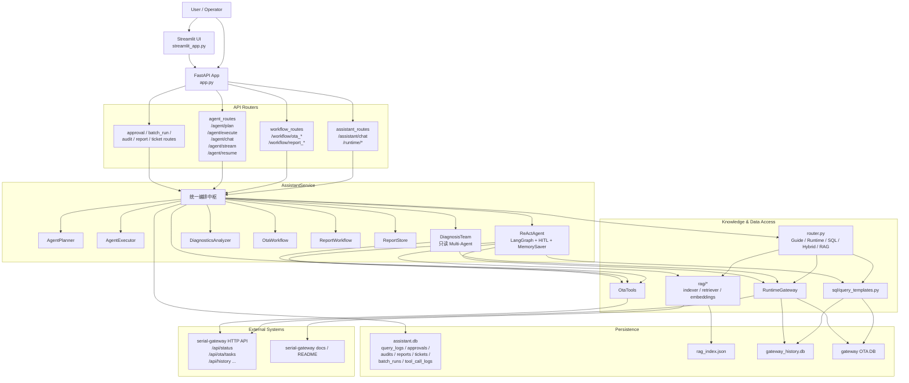

# Gateway AI Assistant

## 项目定位

`gateway_ai_assistant` 是在现有 `serial-gateway` 基础上新增的独立 AI Assistant 模块，目标是用最小侵入方式补充：

- 文档问答能力（RAG）
- 结构化历史数据查询能力（SQL）
- RAG + SQL 的混合分析能力（Hybrid）
- 大模型解释能力
- LangGraph ReAct Agent、多步治理编排与审批中断恢复

## 当前状态（2026-06-30）

当前代码已经不是单纯的 `RAG / SQL / Hybrid` demo，而是包含两条并存链路：

- `V1`：规则路由 `RAG / SQL / Hybrid / Runtime`
- `V2a/V2b`：LangGraph ReAct Agent，支持 `chat / stream / resume`

已经落地的关键能力：

- `POST /assistant/agent/chat`：ReAct 主链路
- `POST /assistant/agent/stream`：SSE 流式事件输出
- `POST /assistant/agent/resume`：`approve / reject / edit` 恢复审批中断
- `GET /assistant/agent/sessions/{session_id}`：查看 session、timeline、上下文观测
- 只读 `DiagnosisTeam`：并行采集设备状态、传感器历史、系统事件、近期 OTA 任务
- `workflow_diagnose_fault()` 与 `workflow_generate_report(report_type="fault_ticket")` 已接入 `DiagnosisTeam`
- OTA 审批、批量推进、暂停、终止、失败重试已形成治理闭环
- 串口不可用时 `serial-gateway` 可降级启动，assistant 会在 `serial_available=false` 时拦住串口 OTA

最近一轮完整回归：

- `pytest -q gateway_ai_assistant/tests`
- 结果：`137 passed, 1 skipped, 1 warning`

该模块不修改 STM32 / ESP32 设备端代码，不重构原 `serial-gateway` 主流程，只读接入现有文档和历史数据。

## 为什么采用双库模式

当前仓库里的真实数据结构并不是理想化 demo schema，而是：

- `serial-gateway/data/gateway_history.db`
  - `system_events`
  - `sensor_events`
- `serial-gateway/data/ota_tasks.json`
  - 实际是 SQLite 数据库
  - 包含 `ota_tasks`、`ota_events`

因此本项目采用双库模式：

1. 现有网关库只读复用  
   不向原历史库写入任何 AI 演示数据。

2. AI Assistant 自建辅助库  
   使用 `gateway_ai_assistant/data/assistant.db` 保存：
   - `query_logs`
   - `rag_document_metadata`
   - `metric_definitions`

这样既能贴合真实仓库结构，又不会污染原系统数据。

## 当前架构

V1 规则链路：

`用户问题 -> router -> RAG / SQL / Hybrid -> prompt 组装 -> LLM -> 响应`

V1 扩展链路：

`用户问题 -> router -> Runtime / RAG / SQL / Hybrid -> prompt 组装 -> LLM -> 响应`

V2 Agent 链路：

`用户问题 -> ReAct Agent -> tools / workflows / HITL interrupt -> resume / stream -> 审计与会话观测`

模块分工：

- [app.py](app.py)
  FastAPI 入口。

- [service.py](service.py)
  主业务编排层，负责路由、SQL 查询、RAG 检索、LLM 调用、日志落库。

- [router.py](router.py)
  规则路由，优先级为 `Hybrid > Runtime > SQL > RAG`。

- [sql/query_templates.py](sql/query_templates.py)
  受控 SQL 模板函数，禁止让大模型自由生成 SQL。

- [rag/indexer.py](rag/indexer.py)
  本地索引构建。

- [rag/retriever.py](rag/retriever.py)
  本地索引检索。

- [llm_client.py](llm_client.py)
  OpenAI-compatible API 封装，未配置 key 时自动降级为 mock。

- [streamlit_app.py](streamlit_app.py)
  演示页面。

- `agent/react_agent.py`
  LangGraph ReAct Agent 封装，负责 tool calling、审批中断、resume、streaming。

- `agent/diagnosis_team.py`
  只读 Multi-Agent 采集层，当前用于诊断与故障报告。

- `tools/runtime_gateway.py`
  运行态工具层，负责设备状态、历史事件、OTA 任务、数据库概况查询，策略为 HTTP API 优先、SQLite fallback。

### 架构总览图

更完整的架构说明见 [ARCHITECTURE.md](ARCHITECTURE.md)。



### 三层职责

1. `serial-gateway`
   真实设备运行层，负责设备通信、历史数据、OTA 执行和 HTTP API。

2. `gateway_ai_assistant`
   AI 编排层，负责问答、诊断、审批、报告、工单、批量 OTA 治理和 Agent 编排。

3. `Streamlit / FastAPI`
   接入与展示层，分别面向交互演示和 API 消费方。

### 关键内部链路

1. V1 问答链路  
   `chat() -> classify_question() -> Runtime / SQL / Hybrid / RAG -> LLM / answer`

2. Workflow 链路  
   `workflow_* -> OtaWorkflow / ReportWorkflow / DiagnosticsAnalyzer -> 持久化 / 审计`

3. LangGraph Agent 链路  
   `chat_agent() -> ReActAgent.invoke() -> tools / interrupt / resume / stream`

4. Multi-Agent 诊断链路  
   `workflow_diagnose_fault()` 和 `fault_ticket report`  
   `-> DiagnosisTeam.collect_runtime_inputs()`  
   `-> DiagnosticsAnalyzer.analyze()`

### 设计边界

- `gateway_ai_assistant` 不直接改 STM32 / ESP32 端逻辑。
- 高风险写操作不直接放给模型，统一经过 HITL 或治理接口。
- `DiagnosisTeam` 当前只限只读采集，不进入审批和写链路。
- V1 路由链路与 V2 LangGraph Agent 并存，保证可降级、可回退。

## 当前实现能力

- `FastAPI` 骨架：
  - `GET /assistant/health`
  - `GET /assistant/demo_questions`
  - `GET /assistant/schema`
  - `POST /assistant/rebuild_index`
  - `POST /assistant/chat`
  - Agent APIs：
    - `POST /assistant/agent/plan`
    - `POST /assistant/agent/execute`
    - `POST /assistant/agent/chat`
    - `POST /assistant/agent/stream`
    - `POST /assistant/agent/resume`
    - `GET /assistant/agent/sessions/{session_id}`
  - Runtime APIs：
    - `POST /assistant/runtime/device_status`
    - `POST /assistant/runtime/sensor_history`
    - `GET /assistant/runtime/system_events`
    - `POST /assistant/runtime/ota_task_status`
    - `GET /assistant/runtime/database_summary`
  - Workflow APIs：
    - `POST /assistant/workflow/ota_risk_check`
    - `POST /assistant/workflow/ota_plan`
    - `POST /assistant/workflow/ota_batch_plan`
    - `POST /assistant/workflow/ota_request_create`
    - `POST /assistant/workflow/ota_batch_request_create`
    - `POST /assistant/workflow/ota_request_confirm`
    - `POST /assistant/workflow/report_generate`
    - `POST /assistant/workflow/diagnose_fault`
  - Governance APIs：
    - `GET /assistant/approvals`
    - `GET /assistant/approvals/{approval_id}`
    - `POST /assistant/approvals/{approval_id}/approve`
    - `POST /assistant/approvals/{approval_id}/reject`
    - `POST /assistant/approvals/{approval_id}/cancel`
    - `POST /assistant/approvals/{approval_id}/retry_failed`
    - `GET /assistant/ota/batch_runs`
    - `GET /assistant/ota/batch_runs/{batch_run_id}`
    - `POST /assistant/ota/batch_runs/{batch_run_id}/refresh`
    - `POST /assistant/ota/batch_runs/{batch_run_id}/start_next_batch`
    - `POST /assistant/ota/batch_runs/{batch_run_id}/pause`
    - `POST /assistant/ota/batch_runs/{batch_run_id}/terminate`
    - `GET /assistant/audit/tool_calls`
    - `GET /assistant/audit/actions`
    - `GET /assistant/reports`
    - `GET /assistant/reports/{report_id}`
    - `GET /assistant/reports/{report_id}/markdown`
    - `POST /assistant/tickets`
    - `GET /assistant/tickets`
    - `GET /assistant/tickets/{ticket_id}`
    - `POST /assistant/tickets/{ticket_id}/assign`
    - `POST /assistant/tickets/{ticket_id}/close`
    - `POST /assistant/tickets/{ticket_id}/reopen`

- 本地 RAG：
  - 数据源优先索引 `serial-gateway/README.md` 和 `serial-gateway/docs/*.md`
  - 索引文件：`gateway_ai_assistant/data/rag_index.json`
  - 元数据入库：`assistant.db.rag_document_metadata`
  - 已支持 `sentence-transformers` 本地 embedding 检索
  - 章节感知切块，chunk 保留 `source_name / section_title / citation`
  - 词法分数 + embedding 分数混合召回
  - MMR 去重重排，减少多个近似片段挤占 TopK
  - query expansion，会为 `OTA / 协议 / 传感器 / 失败` 等问题补充领域检索词
  - source diversity 控制，避免同一文档连续占满 TopK
  - 索引陈旧检测：文档新增、删除、修改，或 embedding backend 变更后会自动重建
  - 依赖缺失时自动降级为本地 hashing 向量 + 词法混合检索

- SQL：
  - 读取真实 `system_events`
  - 读取真实 `sensor_events`
  - 读取真实 `ota_tasks`
  - 读取真实 `ota_events`

- Hybrid：
  - 传感器上报减少类分析
  - OTA 失败增多类分析

- Runtime：
  - `get_device_status`
  - `get_sensor_history`
  - `get_system_events`
  - `get_ota_task_status`
  - `get_database_summary`
  - 明确区分实时接口结果与“基于最近事件推断”的状态

- OTA Workflow：
  - 升级前风险检查
  - 升级计划生成
  - 批量设备灰度分批计划生成
  - 人工确认前仅创建审批请求
  - 人工确认后再调用现有网关 `POST /api/ota/tasks`
  - 批量审批通过后按 ready device 集合逐台创建 OTA 任务
  - 批量失败设备可在治理中心重试
  - 批量执行会持久化为独立 batch run，支持刷新设备级状态
  - 支持严格按批次推进，上一批处理完成后再手动启动下一批
  - 返回 workflow `tool_trace`

- Report Workflow：
  - 故障工单生成
  - 测试报告生成
  - 复用设备状态、传感器历史、系统事件、OTA 任务状态
  - 故障报告自动附带规则诊断结果
  - 返回结构化 sections 和 Markdown 报告正文
  - 自动落盘 `reports/YYYYMMDD/*.md|*.json`

- Diagnostics Workflow：
  - 基于确定性规则做故障诊断
  - 当前支持离线、无上报、CRC 错误、重复 OTA 失败等信号
  - 返回 `overall_severity / findings / tool_trace`
  - 当前由 `DiagnosisTeam` 并行采集运行态输入
  - 结果附带 `team_trace / collection_mode`

- Agent Planner / Executor：
  - 可先生成 plan，再执行 plan
  - 当前支持诊断、报告、OTA 风险检查、OTA 审批请求、OTA 审批确认、通用 chat
  - plan 中每个 step 带 `reason / description / mode`
  - 当前作为确定性执行层保留，与 LangGraph ReAct Agent 并存

- LangGraph ReAct Agent：
  - 支持原生 ReAct tool calling
  - 写操作通过 HITL 审批中断
  - `resume` 支持 `approve / reject / edit`
  - `stream` 支持 `token / tool_start / tool_end / interrupt / final_answer / error / done`
  - `get_agent_session()` 返回 `timeline / final_answer / pending_actions / agent_context / context_warning`

- Multi-Agent（当前第一阶段）：
  - `DiagnosisTeam` 内含 `StatusAgent / SensorAgent / EventAgent / OtaAgent`
  - 限定只读场景，不进入审批写链路
  - 已用于故障诊断和 `fault_ticket` 报告采集

- 数据治理痕迹：
  - `query_logs`
  - `rag_document_metadata`
  - `metric_definitions`
  - `tool_call_logs`
  - `approval_requests`
  - `action_audit_logs`
  - `report_records`
  - `ticket_records`
  - `ota_batch_runs`
  - `ota_batch_run_items`

- Streamlit 演示页：
  - 总览 dashboard 指标卡片
  - 单设备 OTA 风险检查、审批、确认
  - 批量 OTA 灰度计划、批量审批、失败重试、下一批推进
  - 报告生成后直接转工单
  - 审批详情、批量执行中心、报告中心、工单中心、审计中心
  - Agent step timeline 与 session 轨迹查看
  - Agent streaming 事件与 resume 控制
  - 诊断/报告页直接展示 `collection_mode` 与 `team_trace`

## 当前目录

```text
gateway_ai_assistant/
├── app.py
├── config.py
├── llm_client.py
├── router.py
├── service.py
├── streamlit_app.py
├── requirements.txt
├── README_AI_ASSISTANT.md
├── data/
│   ├── assistant.db
│   └── rag_index.json
├── prompts/
├── rag/
├── sql/
└── tests/
```

## 环境变量配置

支持 OpenAI-compatible API，例如 DeepSeek。

需要的环境变量：

```bash
export LLM_API_KEY='your_key'
export LLM_BASE_URL='https://api.deepseek.com'
export LLM_MODEL='deepseek-chat'
```

如果未配置：

- 系统不会崩溃
- 自动降级为 mock answer
- `llm_mode` 会显示为 `mock`

如果已配置成功：

- `llm_mode` 会显示为 `api`
- FastAPI 响应和 Streamlit 页面都会显示当前执行模式

## 安装依赖

```bash
python3 -m pip install -r gateway_ai_assistant/requirements.txt
```

## 启动方式

启动 FastAPI：

```bash
python3 -m uvicorn gateway_ai_assistant.app:app --host 127.0.0.1 --port 8010
```

启动 Streamlit：

```bash
python3 -m streamlit run gateway_ai_assistant/streamlit_app.py
```

运行测试：

```bash
python3 -m unittest discover -s gateway_ai_assistant/tests -v
```

重建本地索引：

```bash
python3 -m gateway_ai_assistant.rag.build_index
```

## FastAPI 接口说明

### `GET /assistant/health`

用途：检查服务和数据源可用性。

示例返回：

```json
{
  "status": "ok",
  "assistant_db": ".../gateway_ai_assistant/data/assistant.db",
  "gateway_history_db_exists": true,
  "gateway_ota_db_exists": true,
  "index_exists": true,
  "index_status": {
    "exists": true,
    "is_stale": false,
    "reason": "fresh",
    "backend": "sentence_transformers",
    "schema_version": 2,
    "source_count": 29
  }
}
```

### `GET /assistant/demo_questions`

用途：返回演示问题列表。

### `GET /assistant/schema`

用途：查看当前接入的 SQLite schema 和样例数据。

### `POST /assistant/rebuild_index`

用途：重建本地 RAG 索引。

示例返回：

```json
{
  "status": "ok",
  "index_path": ".../gateway_ai_assistant/data/rag_index.json",
  "total_chunks": 273,
  "created_at": "2026-06-13T13:17:51.834029+00:00",
  "backend": "sentence_transformers",
  "schema_version": 2,
  "source_count": 29
}
```

### `POST /assistant/chat`

请求：

```json
{
  "question": "AA55 协议帧格式是什么？"
}
```

响应包含：

- `route_type`
- `route_reason`
- `answer`
- `llm_mode`
- `index_status`
- `runtime_result`
- `sql_result`
- `analysis_facts`
- `retrieved_chunks`

其中 `retrieved_chunks` 现在会返回更完整的引用字段：

- `citation`
- `source_name`
- `section_title`

### Runtime APIs

这些接口用于给外部 Agent 或其他前端直接复用运行态查询能力：

- `POST /assistant/runtime/device_status`
  - 请求：`{"device_id": "DEVICE_001"}`
- `POST /assistant/runtime/sensor_history`
  - 请求：`{"device_id": "sensor-01", "limit": 10}`
- `GET /assistant/runtime/system_events?limit=10`
- `POST /assistant/runtime/ota_task_status`
  - 请求：`{"task_id": "ota-001"}`
- `GET /assistant/runtime/database_summary`

这样 `/path/to/external-agent` 一类外部 Agent 不再自己直连 SQLite 或网关 API，而是复用本服务作为统一主后端。
- `lexical_score`
- `semantic_score`
- `matched_terms`
- `score`

## 当前支持的典型问题

RAG：

- `AA55 协议帧格式是什么？`
- `OTA 升级流程是什么？`
- `CRC 校验失败一般有哪些原因？`
- `/api/history 接口是干什么的？`
- `STM32 OTA ACK / NACK 帧有哪些？`
- `device -> gateway 上行帧类型有哪些？`

SQL：

- `最近有哪些系统事件？`
- `最近有哪些传感器上报？`
- `查询 device_id=1 最近一次传感器数据`
- `查询 sensor-01 最近一次传感器数据`
- `统计 OTA 任务状态数量`
- `最近 OTA 失败任务有哪些？`
- `最近 OTA 事件有哪些？`

Hybrid：

- `最近传感器上报减少，可能是什么原因？`
- `最近 OTA 失败任务变多，结合文档分析可能原因`

## 演示建议流程

建议按这个顺序演示：

1. 先打开 `GET /assistant/health`
   说明系统已经只读接入真实网关库。

2. 再问 `AA55 协议帧格式是什么？`
   展示 RAG 和引用片段。

3. 再问 `最近有哪些系统事件？`
   展示真实 `system_events` 查询结果。

4. 再问 `统计 OTA 任务状态数量`
   展示真实 OTA 持久化数据查询结果。

5. 最后问 `最近 OTA 失败任务变多，结合文档分析可能原因`
   展示 Hybrid 的事实 + 文档依据 + 大模型总结。

页面中建议同步观察：

- `Route`
- `LLM Mode`
- `RAG Backend`
- `事实摘要`

## 最终验收命令

1. 安装依赖

```bash
python3 -m pip install -r gateway_ai_assistant/requirements.txt
```

2. 重建索引

```bash
python3 -m gateway_ai_assistant.rag.build_index
```

3. 启动 FastAPI

```bash
python3 -m uvicorn gateway_ai_assistant.app:app --host 127.0.0.1 --port 8010
```

4. 健康检查

```bash
curl -s http://127.0.0.1:8010/assistant/health
```

5. 验证 RAG

```bash
curl -s -X POST http://127.0.0.1:8010/assistant/chat \
  -H 'Content-Type: application/json' \
  -d '{"question":"AA55 协议帧格式是什么？"}'
```

6. 验证 SQL

```bash
curl -s -X POST http://127.0.0.1:8010/assistant/chat \
  -H 'Content-Type: application/json' \
  -d '{"question":"统计 OTA 任务状态数量"}'
```

7. 验证 Hybrid

```bash
curl -s -X POST http://127.0.0.1:8010/assistant/chat \
  -H 'Content-Type: application/json' \
  -d '{"question":"最近 OTA 失败任务变多，结合文档分析可能原因"}'
```

8. 启动 Streamlit

```bash
python3 -m streamlit run gateway_ai_assistant/streamlit_app.py
```

9. 检查查询日志

```bash
sqlite3 gateway_ai_assistant/data/assistant.db \
  "SELECT question, route_type, created_at FROM query_logs ORDER BY id DESC LIMIT 5;"
```

## 当前限制

- 当前默认向量检索优先使用 `sentence-transformers`；若依赖不可用，会自动回退到 hashing 向量 + 词法混合检索。
- 当前仍未引入 FAISS / Chroma 持久化索引库，索引文件仍是 JSON。
- 当前排序规则已经能覆盖主要演示问题，但仍可继续优化。
- 历史库中部分“趋势类”问题受 demo 数据时间分布影响，因此采用“以表内最新时间为基准”来做窗口分析。
- `CRC_ERROR`、`OFFLINE`、`CACHE_BACKLOG` 这类指标当前没有稳定真实来源，没有伪装成真实能力。
- Streamlit 页面是演示型前端，不是生产化监控台。

## 面试介绍话术

可以直接这样介绍：

“我在原来的边缘网关系统基础上，新增了一个大模型智能运维与数据分析助手。这个模块没有改动设备端，也没有重构原网关服务，而是以独立服务的方式接入现有网关文档和历史数据。RAG 部分优先索引项目已有 README 和 docs 文档，用于回答协议、OTA、CRC、Bootloader 和接口流程相关问题；SQL 部分只读查询现有网关 SQLite 中的 system_events 和 sensor_events，以及 OTA 持久化库中的 ota_tasks 和 ota_events，用于查询系统事件、传感器上报、OTA 任务和失败原因。对于原系统暂时没有稳定数据来源的 CRC_ERROR、OFFLINE、CACHE_BACKLOG 等指标，我没有直接伪造为真实能力，而是保留为后续扩展。系统通过规则路由判断问题属于文档问答、结构化查询还是混合分析，并由大模型基于检索片段和 SQL 结果生成解释性回答。这个 demo 主要体现了我把大模型应用、RAG、SQL 查询和数据智能分析能力接入已有工程系统的能力。” 
